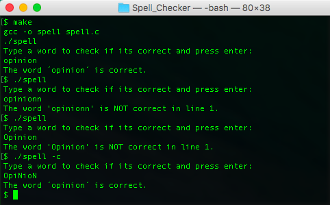
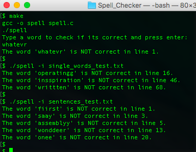
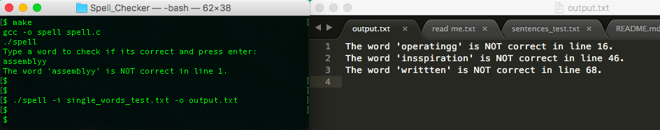

# Spell checker program in C

##Programming Fundamentals (SET07109) 2017

### Coursework 1 - Edinburgh Napier University

Compiled using GCC Apple LLVM version 8.0.0

**How to run the program:**

1. Write in the console "make" to run the makefile, which will compile the program.

2. The program will prompt the user to write a word if it is correct.

3. If the word is not correct, the program will say so.

4. Write a line with arguments each time the user wants to check something, constructed as shown below:

The arguments that can be used are:

| Argument input    | what it does                  |
|-------------------|-------------------------------|
|	-i <filename.c>		|	to check the words on a file 	|
|	-o <filename.c>		|	to output answer to a file 		|
|	-c 					      |	to ignore case			 	      	|

They must be written after ./spell each time.

So to check if a word is correct ignoring the case, write:
./spell -c
and then the program will prompt you to write the word.

To check a file, outputing the answer to a new file, instead of to the console, ignoring the case, it will be:
./spell -i <filename.c> -o output.txt -c

**Screenshots**

Running normal program with single words:

To check text in a file:

To output results to a file:

